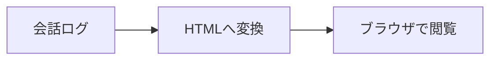

# Chat HTML Converter

ChatGPTのテキストログを、絵文字付きのチャット風HTMLへ変換する日本語ウェブアプリです。元の `ChatHtmlConverter.java` の表示とMarkdown変換を引き継いでいます。

## できること

- ログの貼り付け、UTF-8の `.txt` / `.md` ファイルの読み込み（最大2 MiB）
- PNG / JPEG / GIF / WebPの画像を複数追加（各10 MiB、合計20 MiB）。ログのカーソル位置に画像の行を挿入し、行を移動して表示位置を変更できます。追加画像の削除にも対応します。
- 吹き出し表示のプレビュー、単独で開ける `chat-emoji.html` のダウンロード
- 見出し、太字、インラインコード、コードブロックの変換
- ` ```mermaid ` コードブロックをフローチャート、シーケンス図などのSVGへ変換
- スマートフォンからの利用

画像はブラウザ内で読み込み、プレビューとダウンロードHTMLにデータURLとして埋め込みます。画像データはサーバーに送信しません。画像の挿入行とファイル名はログとともに送信されます。保存したHTMLには画像も含まれるため、画像ファイルを別途保存する必要はありません。画像は先に話者マーカーを入力してから追加してください（空の入力欄に追加した場合は `User:` を補います）。コードブロック内の画像記法は文字として表示されます。

Mermaid図は変換画面のブラウザ内でSVG化し、保存するHTMLへ直接埋め込みます。図を含むログの変換時だけ、固定バージョンのMermaid描画ライブラリをjsDelivrから読み込むためインターネット接続が必要です。完成したHTMLの閲覧には通信もJavaScriptも不要です。Mermaidは `securityLevel: 'strict'` として実行し、埋め込み前のSVGから実行可能要素・イベント属性・外部リンク属性を除去します。

入力は変換時にサーバーへ送信します。アプリは会話本文をファイル・データベース・アクセスログに保存しません。ブラウザのローカルストレージも使いません。ページの再読み込みで入力は消えます。HTML内のユーザー入力はエスケープし、プレビューはsandbox付きiframeで表示します。

## 入力形式

話者名を単独の行に置き、次の行から本文を書きます。

````text
User:
こんにちは！

Assistant:
# こんにちは
**太字** と `コード` に対応しています。

```java
System.out.println("Hello!");
```


````

ユーザー側は `User:` / `あなた:` / `自分:`、アシスタント側は `Assistant:` / `ChatGPT:` / `AI:` に対応します。英字の大小は区別しません。区切りは半角コロンです。最初の話者マーカーより前の文章は無視されます。コードブロック内の話者マーカーは本文として保持します。Mermaidの開始フェンスは ` ```mermaid `（大文字・小文字は不問）です。JSON・ZIPのChatGPTエクスポートや、一般的なMarkdownの表・リストの整形には対応していません。

## ローカルで起動

Java 21以降が必要です。追加ライブラリ・APIキー・データベースは不要です。

```sh
mkdir -p out
javac --release 21 --add-modules jdk.httpserver -encoding UTF-8 -d out src/*.java
java --add-modules jdk.httpserver -cp out WebServer
```

プロジェクトのルートで実行し、ブラウザで http://localhost:10000 を開きます。停止は Ctrl+C。ポートは環境変数 `PORT` で変更できます。

## Renderで公開

JavaはDockerでデプロイします。`Dockerfile` と `render.yaml` を用意してあります。

1. GitHubにこのプロジェクト用のリポジトリを作成し、プロジェクトのファイルをpushします（`out/` や実際の会話ログは含めません）。
2. [Render Dashboard](https://dashboard.render.com/) で **New → Blueprint** を選び、GitHubリポジトリを接続します。
3. ルートの `render.yaml` が検出されたことと、サービス名・Freeプランを確認してデプロイします。
4. デプロイ完了後、発行された `https://…onrender.com` を開きます。

手動で **New → Web Service** を選ぶ場合は、リポジトリを指定し、Languageを **Docker**、Dockerfile Pathを `./Dockerfile`、Health Check Pathを `/healthz`、プランを **Free** にしてください。Docker Commandは空欄で構いません。ルートディレクトリはこのプロジェクトのルートです。

サーバーはRenderの `PORT` を使い、`0.0.0.0` で待ち受けます。無料サービスはアイドル後の起動に時間がかかる場合があります。ログイン機能はないため、公開URLへアクセスできる人は誰でも変換機能を利用できます。

参照: [RenderのDocker対応](https://render.com/docs/docker)、[Web Services](https://render.com/docs/web-services)、[Blueprint仕様](https://render.com/docs/blueprint-spec)、[Freeプラン](https://render.com/docs/free)

## 動作確認

```sh
javac --release 21 --add-modules jdk.httpserver -encoding UTF-8 -d out src/*.java tests/ConverterTest.java
java -cp out ConverterTest
```

サーバーを起動した別のターミナルで:

```sh
python3 tests/http_test.py
```

Dockerでもビルド時に変換テストを実行します。

```sh
docker build -t chat-html-converter .
docker run --rm -p 10000:10000 chat-html-converter
```

元のコマンドライン版も残してあります。ルートに `chat.txt` を置いて `java -cp out ChatHtmlConverter` を実行すると、`chat-emoji.html` を出力します。

## オンラインデモ
https://chat-html-converter3.onrender.com/
